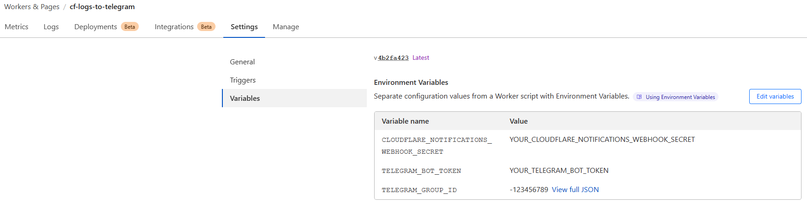
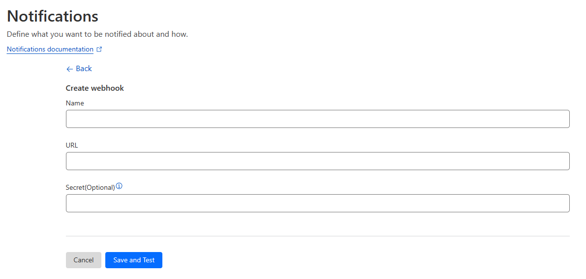
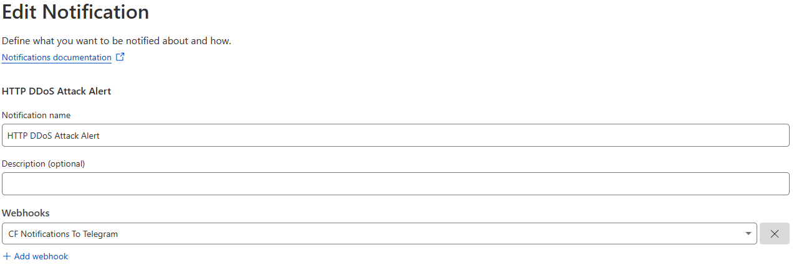
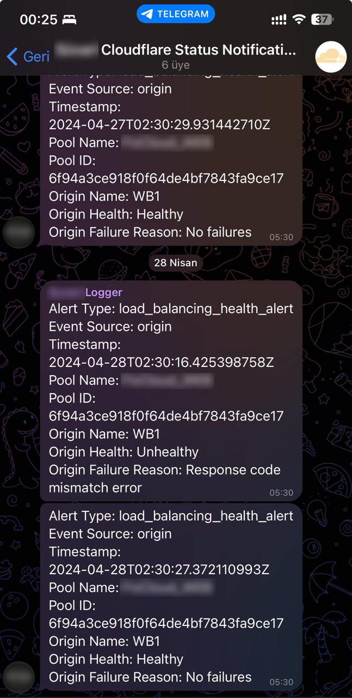

# Telegram-Notification-Worker

If you are a paid Cloudflare user, you can receive real-time notifications from your Cloudflare account via Telegram by creating a webhook.

# Installation Steps

1. Click the “Deploy to Cloudflare Workers” button to add the Worker to your Cloudflare account.
2. Navigate to the Settings / Variables section under the Worker. Click the “Edit variables” button to modify the values.

`CLOUDFLARE_NOTIFICATIONS_WEBHOOK_SECRET`: A completely custom secret word of your choice.

`TELEGRAM_BOT_TOKEN`: The Telegram Bot Token provided by Botfather.

`TELEGRAM_GROUP_ID`: The ID value of the Telegram group where notifications will be sent. Note: The bot used must be a member of the group.

3. Log in to your Cloudflare account and navigate to the Notifications section. Click the Create button in the Destinations section. If you don’t see the Destinations option, it’s possible that your Cloudflare account does not have any paid sites.

In the Name section, you can provide any name you prefer.

In the URL field, enter the address of the Worker you created (e.g., https://cf-logs-to-telegram.mertsarac.workers.dev/).

In the Secret field, write the secret word you specified in the `CLOUDFLARE_NOTIFICATIONS_WEBHOOK_SECRET` environment variable.

4. Congratulations, your bot is ready! Now all you need to do is define this webhook in Cloudflare notifications.

